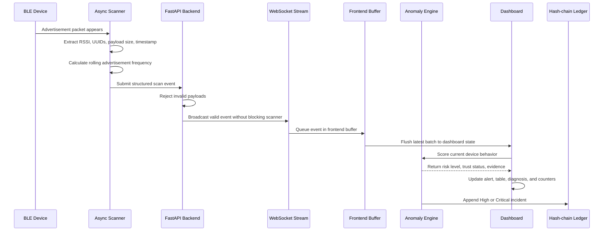
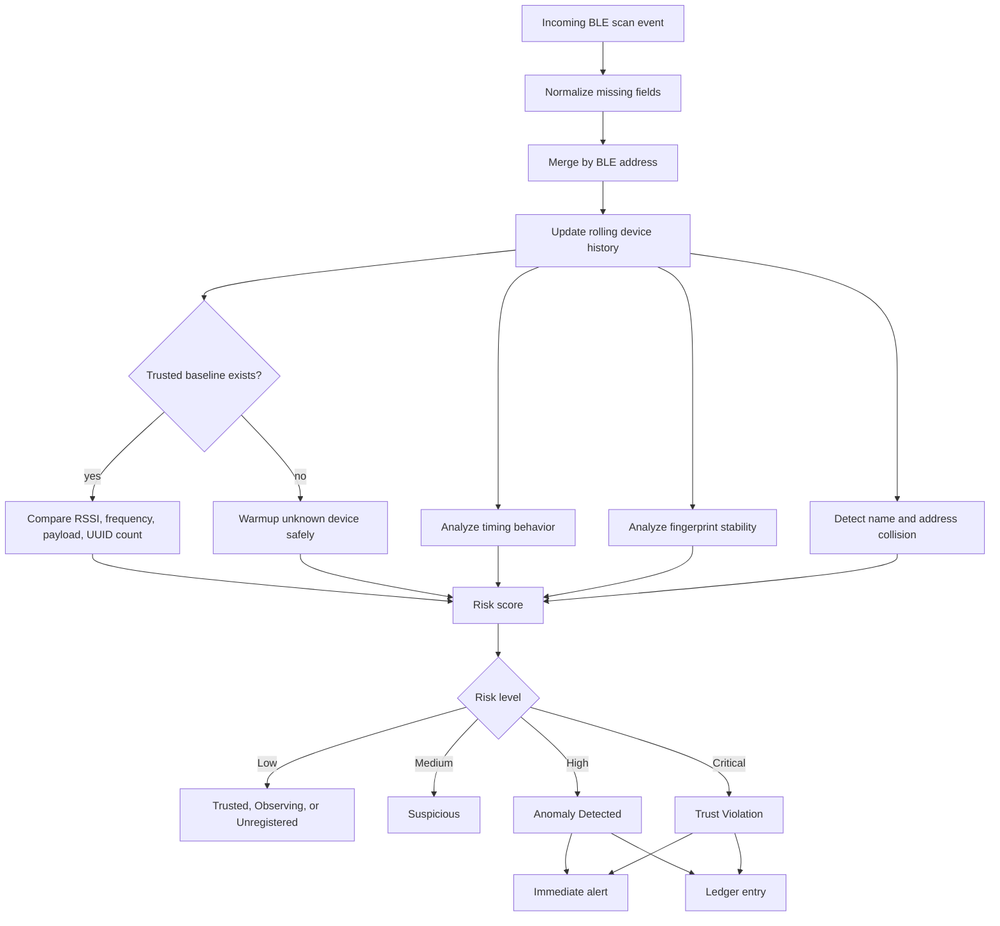

# BLE Trust Registry

**Real-time Trust Monitoring for Bluetooth Low Energy Devices**

[](https://www.python.org/downloads/)
[](https://nextjs.org/)
[](https://fastapi.tiangolo.com/)
[](#)

## Overview

BLE Trust Registry is a defensive monitoring system for Bluetooth Low Energy environments. It watches nearby BLE advertisements in real time, resolves practical device identity, trains trusted baselines, detects suspicious behavior, and records serious incidents in a tamper-evident hash-chain ledger.

The project is designed as a serious security dashboard. It is not a simulation-first template. Live scanner events move through a validation layer, WebSocket stream, frontend event buffer, anomaly engine, alert system, and local ledger.

## The Problem

BLE devices advertise constantly. In a busy lab, campus, office, or hospital environment, many devices appear with weak names, changing addresses, unstable signal strength, and incomplete identity metadata. A basic BLE scanner can show nearby devices, but it does not answer the more important question:

**Does this device still behave like the device we trusted before?**

BLE Trust Registry approaches this as a behavioral trust problem. It does not assume every unknown device is malicious. It watches behavior over time, compares trusted devices against saved baselines, and escalates only when evidence supports the risk.

## What It Does

- Performs live BLE scanning through an asynchronous FastAPI backend.
- Resolves readable display names from advertised names, cached names, manufacturer clues, service UUID hints, and address suffixes.
- Validates scan events before they are broadcast to the dashboard.
- Streams events through a single WebSocket lifecycle manager.
- Buffers incoming events so the dashboard remains responsive.
- Maintains the latest device state indexed by BLE address.
- Trains trusted baselines from observed live samples.
- Detects RSSI, frequency, payload, UUID, timing, fingerprint, and identity drift.
- Shows High and Critical trust violations immediately.
- Stores serious incidents in a local hash-chain ledger.

## System Component Overview

```mermaid
graph TD
    A[BLE Radio Environment] --> B[scanner-backend<br/>Async BLE scanner]
    B --> C[name_resolver.py<br/>Identity enrichment]
    C --> D[models.py<br/>Pydantic validation]
    D --> E[main.py<br/>FastAPI control plane]
    E --> F[/ws/scan-events<br/>WebSocket stream]

    F --> G[frontend/lib/websocket.ts<br/>Single lifecycle manager]
    G --> H[Event buffer<br/>500 ms batch flush]
    H --> I[Device state map<br/>Indexed by BLE address]
    I --> J[Runtime analysis<br/>Rolling history]
    J --> K[anomalyEngine.ts<br/>Trust scoring]

    K --> L[Alert banner<br/>Immediate High or Critical status]
    K --> M[Live BLE table<br/>Stable device rows]
    K --> N[Diagnosis panel<br/>Evidence and recommended action]
    K --> O[hashChain.ts<br/>Tamper-evident ledger]
```

## Runtime Data Flow



## Trust Scoring Pipeline



## Pipeline Explanation

The scanner backend starts the pipeline by listening for BLE advertisements. It extracts the practical security fields that matter for behavior analysis: signal strength, service UUID count, manufacturer data length, approximate payload length, advertisement frequency, timestamp, source, and display identity.

Name resolution improves raw BLE output before it reaches the UI. The backend uses advertised names when available, cached address names when useful, manufacturer clues when possible, service UUID guesses when helpful, and a BLE address suffix as the final fallback. This makes the dashboard readable without pretending that a guessed name proves trust.

Validation is the system gate. Events must match the expected scan payload before they are broadcast. This protects the dashboard from malformed controlled test events and keeps frontend assumptions stable.

The frontend receives events through one WebSocket manager. It does not create duplicate listeners after reconnects. Incoming events are queued in a buffer and flushed in batches, which keeps the UI responsive even when BLE advertisements arrive quickly.

The dashboard then keeps the latest device state indexed by address. This lets table rows update smoothly instead of re-rendering the whole dashboard for every event. Recent history is capped to the useful analysis window, so memory use remains controlled during long monitoring sessions.

The anomaly engine is evidence-driven. Unknown devices begin as Observing. If they remain normal after warmup, they stay Low risk as Unregistered. A device becomes Trusted only after a baseline is saved. When trusted behavior drifts across frequency, RSSI, payload, UUID count, timing, fingerprint, or identity evidence, the risk score rises.

High and Critical results bypass slow visual treatment. The alert banner changes immediately, the diagnosis panel explains the evidence, and the incident is appended to the hash-chain ledger.

## Installation

Install these first:

- Python 3.11 or newer
- Node.js 20 or newer
- A BLE capable adapter
- PowerShell or Command Prompt

Clone the repository:

```powershell
git clone https://github.com/manasvi-0523/BLE_TRUST-REGISTRY.git
cd BLE_TRUST-REGISTRY
```

Install backend dependencies:

```powershell
cd scanner-backend
python -m venv .venv
.\.venv\Scripts\activate
pip install -r requirements.txt
```

Install frontend dependencies:

```powershell
cd ..\frontend
npm.cmd install
```

## Usage

Start both services:

```powershell
cd BLE_TRUST-REGISTRY
.\scripts\start-dev.cmd
```

Open the dashboard:

```text
http://localhost:3000
```

Check backend status:

```text
http://127.0.0.1:8000/status
```

Manual backend run:

```powershell
cd BLE_TRUST-REGISTRY\scanner-backend
python -m uvicorn main:app --host 127.0.0.1 --port 8000
```

Manual frontend run:

```powershell
cd BLE_TRUST-REGISTRY\frontend
npm.cmd run dev
```

## API Surface

```text
GET  /status
POST /start-monitoring
POST /stop-monitoring
POST /scan-event
WS   /ws/scan-events
```

## Dashboard Principles

- Alert banner stays solid and readable.
- Live BLE table stays solid, dense, and stable.
- Secondary panels use restrained glassmorphism only.
- High and Critical alerts render immediately.
- Device rows use stable BLE address keys.
- WebSocket events are batched before state updates.
- Recent history is capped to avoid runaway memory growth.
- Hash-chain logging does not block live monitoring.

## Documentation

Additional guides are available in:

```text
docs/architecture.md
docs/workflow.md
docs/installation.md
docs/troubleshooting.md
```

## Limitations

- BLE names are not proof of identity.
- Address randomization can make long-term tracking harder.
- RSSI varies with distance, walls, antenna orientation, and environment.
- Browser local storage is not a secure database.
- The hash-chain ledger detects local chain tampering, but it does not prevent deletion.
- This project is a defensive prototype, not a production security appliance.

## Ethical Scope

Use this project only on devices and environments you own or have permission to monitor. The project does not include unauthorized BLE exploitation, credential capture, malicious payloads, device compromise, or offensive automation.

## Contributors

| Name | Role | Responsibilities | Contact |
| --- | --- | --- | --- |
| Mithun Gowda B | Core Developer | Main development, full-stack development | mithungowda.b7411@gmail.com |
| Nevil Dsouza | Team Leader | Core development, testing | nevilansondsouza@gmail.com |
| Naren V | Developer | UI design | narenbhaskar2007@gmail.com |
| Manas Habbu | Developer | Documentation, presentation, design | manaskiranhabbu@gmail.com |
| Manasvi R | Developer | Documentation, presentation, design | manasvi0523@gmail.com |
