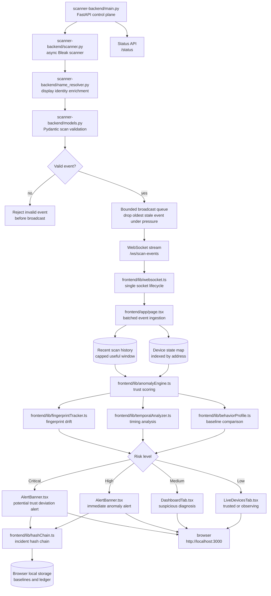
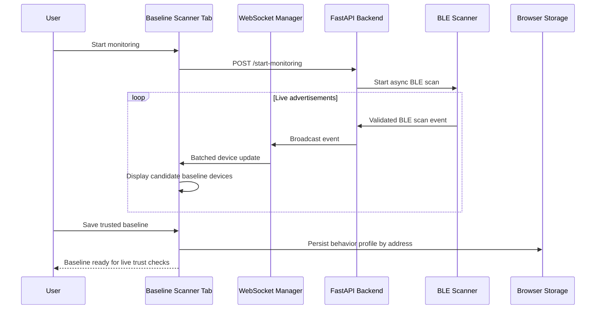
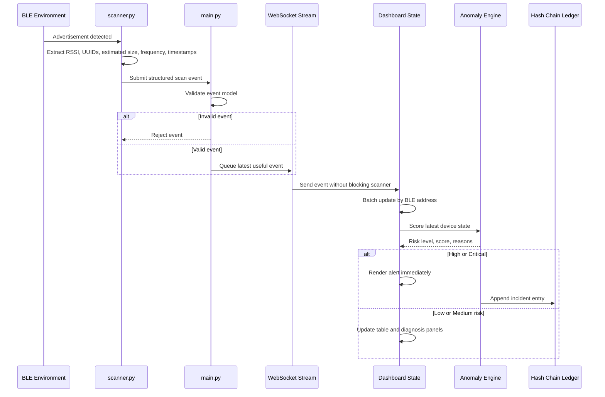
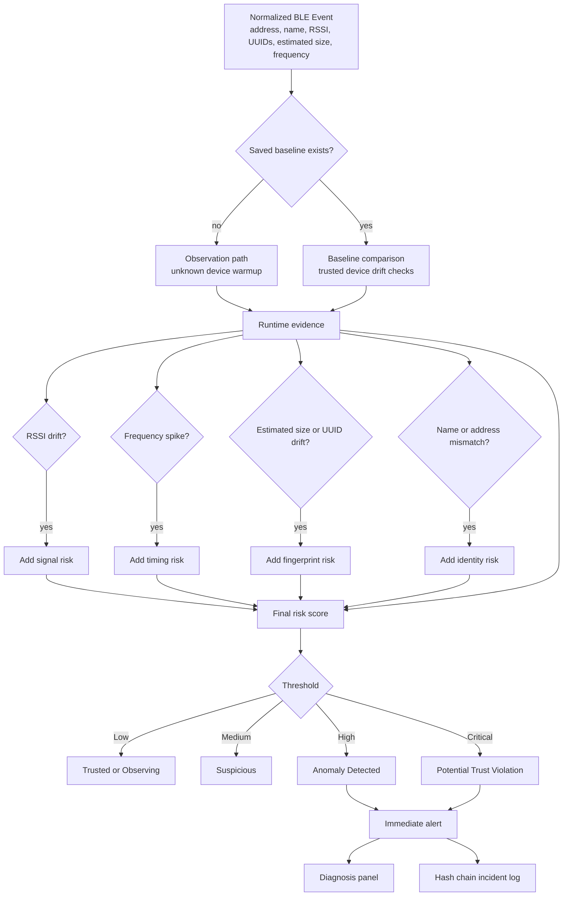

# BLE Trust Registry

**A real-time Bluetooth Low Energy monitoring and behavioral trust assessment system for live device observation, trusted baseline comparison, anomaly detection, and tamper-evident incident logging.**

[](https://www.python.org/downloads/)
[](https://fastapi.tiangolo.com/)
[](https://nextjs.org/)
[](https://www.typescriptlang.org/)
[](#)

## Problem Statement

Bluetooth Low Energy devices constantly advertise their presence. In a real environment such as a lab, office, campus, smart room, or hospital, many nearby devices may appear at the same time with partial names, rotating addresses, shifting RSSI values, repeated service UUIDs, and inconsistent payloads.

A normal BLE scanner can answer a simple question:

```text
Which devices are nearby?
```

BLE Trust Registry is built to answer a stronger security question:

```text
Does this device still behave like the device we trusted earlier?
```

The project treats BLE monitoring as a trust and behavior problem. It does not blindly trust a device name. It does not immediately label every unknown device as malicious. Instead, it observes live BLE advertisements, builds practical identity context, stores trusted baselines, compares new behavior against those baselines, and escalates only when the evidence shows drift or risk.

The system is designed for a professional defensive workflow:

- Watch live BLE advertisements without blocking the scanner loop.
- Maintain a fast dashboard during high-frequency BLE activity.
- Train trusted baselines from real observed devices.
- Detect suspicious identity mismatch, unstable fingerprints, unusual advertisement frequency, estimated advertisement size drift, and RSSI behavior changes.
- Show High and Critical behavioral trust alerts immediately.
- Record serious incidents in a hash-chain ledger so tampering can be detected.

## Core Idea

BLE Trust Registry is not a simulation-first UI. It is structured as a live monitoring pipeline:

```text
BLE radio environment
to asynchronous scanner
to validated event stream
to dashboard state buffer
to trust scoring engine
to alerting and ledger evidence
```

The dashboard is intentionally restrained. The live table and alert banner stay solid and readable. Secondary panels use controlled glassmorphism only as a background treatment. The UI direction is closer to Elastic SIEM and Grafana than to a neon showcase template.

## Architecture

### System Component Overview



### Baseline Capture Data Flow



### Live Monitoring Data Flow



### Trust Scoring Workflow



## Pipeline Explanation

### 1. BLE Observation Layer

The backend listens to the physical BLE environment through the local Bluetooth adapter. When supported by the platform, scanning uses active mode so the backend can receive richer advertisement information. The scanner runs asynchronously so BLE detection does not wait on dashboard rendering, logging, or client connection speed.

### 2. Event Extraction Layer

Each detection is converted into a structured scan event. The backend extracts address, RSSI, service UUIDs, manufacturer data length, estimated advertisement size, first seen time, last seen time, and rolling advertisement frequency.

Advertisement frequency is calculated through a rolling per-address window. This is efficient because the scanner only keeps recent timestamps for each address and removes old timestamps outside the active window.

### 3. Identity Enrichment Layer

BLE names can be missing, weak, misleading, or reused. The name resolver improves readability by using the best available source in this order:

1. Advertised local name.
2. Cached address name.
3. Manufacturer clue.
4. Service UUID hint.
5. Address suffix fallback.

This makes the dashboard usable without pretending that display names are cryptographic identity.

### 4. Validation and Broadcast Layer

The backend validates scan events before broadcasting. Invalid events are rejected early. Valid events enter a bounded queue used by the WebSocket broadcaster.

The queue is intentionally non-blocking. If BLE events arrive faster than clients can consume them, the system drops the oldest stale event and keeps the newest useful event. This protects the scanner loop and keeps the live dashboard close to real time.

The `/status` endpoint exposes scanner state, connected clients, adapter status, last scan time, and current broadcast queue size.

### 5. Frontend WebSocket Layer

The dashboard uses a single WebSocket lifecycle manager. Reconnects are guarded so duplicate event listeners are not created. Incoming scan events are buffered and flushed in batches instead of forcing a complete dashboard update for every advertisement.

This keeps the UI responsive during live monitoring and supports the target behavior of local scanner events appearing quickly on the dashboard.

### 6. Device State Layer

The frontend keeps the latest device state indexed by BLE address. This gives fast lookup, stable React keys, and smooth device table updates.

Recent scan history is capped to the latest useful window. The system keeps enough history for trend and anomaly analysis while avoiding unbounded memory growth during long sessions.

### 7. Trust and Anomaly Layer

The anomaly engine compares live behavior against trusted baselines and runtime evidence. It checks:

- RSSI drift.
- Advertisement frequency drift.
- Estimated advertisement size drift.
- Service UUID count changes.
- Timing instability.
- Fingerprint changes.
- Name and address mismatch.
- Repeated identity collision behavior.

Unknown devices are allowed to warm up before aggressive scoring. Trusted devices are scored more strictly because they have a saved baseline. High and Critical risk levels create immediate visual alerts.

### 8. Incident Ledger Layer

Serious incidents are written into a hash-chain ledger. Each entry includes incident evidence and a hash linked to the previous entry. This does not prevent deletion, but it makes local tampering detectable when the chain is verified.

Hash-chain logging is kept separate from the scanner loop and live UI path, so logging does not delay real-time monitoring.

## Performance and Latency Design

The dashboard is built around real-time responsiveness:

- Scanner callbacks schedule async work instead of blocking BLE detection.
- WebSocket broadcasting uses a bounded queue.
- Queue pressure drops stale events instead of blocking the scanner.
- Frontend events are batched before table, alert, and diagnosis updates.
- Latest device state is indexed by BLE address.
- Device rows use stable keys.
- Recent history is capped to a useful window.
- Potential trust deviation alerts render immediately.
- Decorative animation is not used in the live alert path.
- Hash-chain ledger writes do not sit in the critical scanner-to-alert path.

Target behavior on localhost:

```text
BLE scan event to visible dashboard update: under 500 ms when system load and adapter behavior allow it.
```

## Dashboard UX Direction

The interface is designed as a serious monitoring tool:

- Solid alert banner for maximum readability.
- Solid dark live BLE table for scan-heavy work.
- Restrained glassmorphism only for secondary panels.
- Thin slate borders, low blur, high contrast text.
- No neon cards, no animated glass blobs, no transparent table rows.
- Dense operational layout inspired by SIEM and observability dashboards.

## Installation

Install these requirements first:

- Python 3.11 or newer.
- Node.js 20 or newer.
- Git.
- A BLE capable adapter.
- Windows PowerShell or Command Prompt.

Clone the repository:

```powershell
git clone https://github.com/manasvi-0523/BLE_TRUST-REGISTRY.git
cd BLE_TRUST-REGISTRY
```

Install backend dependencies:

```powershell
cd scanner-backend
python -m venv .venv
.\.venv\Scripts\activate
pip install -r requirements.txt
```

Install frontend dependencies:

```powershell
cd ..\frontend
npm.cmd install
```

## Running The Project

Start both backend and frontend:

```powershell
cd BLE_TRUST-REGISTRY
.\scripts\start-dev.cmd
```

Open the dashboard:

```text
http://localhost:3000
```

Check backend status:

```text
http://127.0.0.1:8000/status
```

Run the backend manually:

```powershell
cd BLE_TRUST-REGISTRY\scanner-backend
python -m uvicorn main:app --host 127.0.0.1 --port 8000
```

Run the frontend manually:

```powershell
cd BLE_TRUST-REGISTRY\frontend
npm.cmd run dev
```

Build the frontend:

```powershell
cd BLE_TRUST-REGISTRY\frontend
npm.cmd run build
```

Compile check the backend:

```powershell
cd BLE_TRUST-REGISTRY\scanner-backend
python -m py_compile main.py models.py name_resolver.py scanner.py
```

## API Surface

```text
GET  /status
POST /start-monitoring
POST /stop-monitoring
POST /scan-event
WS   /ws/scan-events
```

## Main Data Contract

The live scan event contains the operational fields used by the dashboard and anomaly engine:

```text
address
displayName
rawName
rssi
serviceUuids
manufacturerDataLength
advertisementFrequency
estimatedAdvertisementSize
firstSeenAt
lastSeenAt
source
```

The scanner status contains:

```text
running
connectedClients
adapterStatus
lastScanTime
broadcastQueueSize
```

## What Counts As A Potential Trust Violation

A potential trust violation is not based on one weak signal. The system raises serious risk when multiple pieces of evidence point toward identity or behavior drift. Examples include:

- A trusted device name appears with an unexpected address pattern.
- A trusted address begins advertising a different name or fingerprint.
- Advertisement frequency becomes unusually aggressive.
- Estimated advertisement size shifts outside the baseline tolerance.
- UUID behavior changes in a way that does not match the saved trusted profile.
- RSSI and timing behavior support the same suspicious conclusion.

## Limitations

- BLE display names are not proof of identity.
- Address randomization can make long-term tracking harder.
- RSSI changes with distance, walls, antenna direction, and environment.
- Browser local storage is not a secure production database.
- The ledger detects local chain tampering, but it does not prevent deletion.
- This is a defensive prototype, not a certified production security appliance.

## Ethical Scope

Use this project only in environments where you have permission to monitor BLE devices. The project is intended for defensive observation, controlled testing, and education. It does not include unauthorized exploitation, credential capture, malicious payloads, device compromise, or offensive automation.

## Contributors

| Name | Role |  GitHub | Contact |
| --- | --- | --- | --- |
| Manasvi R | Core Developer | [@manasvi-0523](https://github.com/manasvi-0523) | manasvi0523@gmail.com |
| Mithun Gowda B | Controlled Anomaly Test Developer | [@mithun50](https://github.com/mithun50) | mithungowda.b7411@gmail.com |
| Nevil Dsouza | Tester | [@nevil06](https://github.com/nevil06) | nevilansondsouza@gmail.com |
| Manas Habbu | Team Member | [@Manas-H13](https://github.com/Manas-H13) | manaskiranhabbu@gmail.com |
| Naren V | Team Member | [@narenvk-29](https://github.com/narenvk-29) | narenbhaskar2007@gmail.com |

## Disclaimer
Use this only on networks and devices you own or have explicit permission to monitor. Passive BLE scanning may be subject to local regulations on radio monitoring and data collection in some jurisdictions. The authors take no responsibility for misuse.
