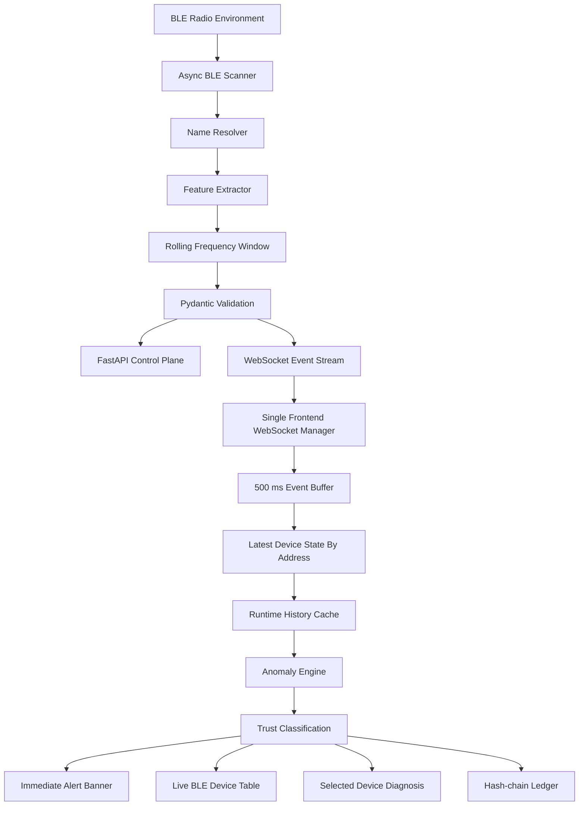
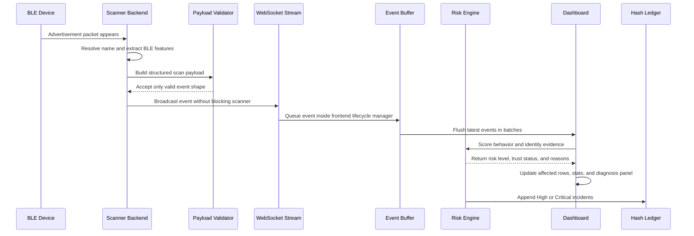
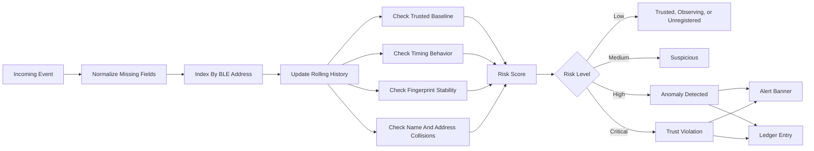

# BLE Trust Registry

BLE Trust Registry is a real-time BLE trust monitoring system. It watches the local Bluetooth Low Energy environment, learns trusted device behavior, detects identity drift, surfaces risky activity without delay, and records serious incidents in a tamper-evident hash-chain ledger.

This project is built as a serious monitoring console, not a glossy landing page and not a simulation-first toy. The core flow is live scanner to validated backend event, WebSocket stream, buffered dashboard update, risk engine decision, alert, and ledger record.

## The Idea

BLE environments are noisy. Nearby devices can appear with weak names, changing payloads, random addresses, and incomplete identity signals. A basic scanner only lists devices. BLE Trust Registry turns those observations into a trust workflow:

1. Observe live BLE advertisements.
2. Resolve the clearest possible device identity.
3. Train trusted baselines for devices you own.
4. Compare live behavior against historical expectations.
5. Show normal unknown devices without panic.
6. Escalate only when evidence supports High or Critical risk.
7. Preserve serious incidents in a local hash-chain ledger.

## System Architecture



## Live Monitoring Workflow



## Trust Decision Pipeline



## Pipeline Workflow

The system pipeline begins at the BLE radio layer. Nearby BLE devices continuously emit advertisement packets, and the scanner backend observes those packets without forcing the dashboard to wait. Every scan event is converted into a structured security signal containing identity hints, RSSI, advertisement frequency, service UUID count, manufacturer data length, payload length, timestamp, and event source.

The backend then performs name resolution and validation. The name resolver tries to produce a useful display name from advertised names, cached names, manufacturer clues, service UUID guesses, and address suffixes. After enrichment, Pydantic validation acts as the gatekeeper. Invalid or malformed payloads stop at the backend and are not broadcast into the live monitor.

Valid events move through the WebSocket stream. The frontend uses one WebSocket lifecycle manager so reconnects do not create duplicate listeners. Events are received immediately, placed into a short buffer, and flushed into React state in batches. This is what keeps the dashboard responsive during live scanning instead of freezing on every advertisement.

Once events reach the dashboard state, devices are indexed by BLE address. The latest state for each address is kept fast to access, while recent history is capped to the useful window needed for scoring. That rolling history feeds timing checks, fingerprint checks, RSSI analysis, advertisement frequency behavior, payload drift, and service UUID changes.

The anomaly engine does not treat unknown devices as guilty by default. A new device starts as Observing while enough evidence is collected. If it remains normal after warmup, it becomes Unregistered with Low risk. A device becomes Trusted only after a baseline is saved. When a trusted device deviates from its baseline, or when identity collision and behavior drift appear together, the risk level moves toward Suspicious, High, or Critical.

High and Critical events are treated differently from ordinary scan noise. They update the alert banner immediately and are written into the hash-chain ledger. The ledger links each incident to the previous hash so local tampering becomes visible when integrity is checked.

The result is a live trust workflow: scan, enrich, validate, stream, buffer, index, score, alert, and record. Each stage has a clear responsibility, which keeps the project understandable, testable, and practical to run from a fresh clone.

## Installation

Install:

- Python 3.11 or newer
- Node.js 20 or newer
- A BLE capable adapter
- PowerShell or Command Prompt

Clone and enter the app:

```powershell
git clone https://github.com/manasvi-0523/BLE_TRUST-REGISTRY.git
cd BLE_TRUST-REGISTRY
```

Install backend dependencies:

```powershell
cd scanner-backend
python -m venv .venv
.\.venv\Scripts\activate
pip install -r requirements.txt
```

Install frontend dependencies:

```powershell
cd ..\frontend
npm.cmd install
```

## Run

From the application root:

```powershell
cd BLE_TRUST-REGISTRY
.\scripts\start-dev.cmd
```

Open:

```text
http://localhost:3000
```

Backend status:

```text
http://127.0.0.1:8000/status
```

## Manual Run

Backend:

```powershell
cd BLE_TRUST-REGISTRY\scanner-backend
python -m uvicorn main:app --host 127.0.0.1 --port 8000
```

Frontend:

```powershell
cd BLE_TRUST-REGISTRY\frontend
npm.cmd run dev
```

## Dashboard Behavior

- Alert banner stays solid and readable.
- Live BLE table stays solid and dense.
- Secondary panels use restrained glassmorphism only.
- WebSocket events are batched before chart or table state updates.
- Device state is indexed by address for fast lookup.
- High and Critical alerts are not delayed by animation.
- Recent scan history is capped to avoid runaway memory growth.
- Hash-chain logging does not block the scanner loop.

## Backend API

```text
GET  /status
POST /start-monitoring
POST /stop-monitoring
POST /scan-event
WS   /ws/scan-events
```

## Documentation

```text
docs/architecture.md
docs/workflow.md
docs/installation.md
docs/troubleshooting.md
```

## Contributors

| Name | Role | Responsibilities | Contact |
| --- | --- | --- | --- |
| Mithun Gowda B | Core Developer | Main development, full-stack development | mithungowda.b7411@gmail.com |
| Nevil Dsouza | Team Leader | Core development, testing | nevilansondsouza@gmail.com |
| Naren V | Developer | UI design | narenbhaskar2007@gmail.com |
| Manas Habbu | Developer | Documentation, presentation, design | manaskiranhabbu@gmail.com |
| Manasvi R | Developer | Documentation, presentation, design | manasvi0523@gmail.com |

## Ethical Scope

This project is defensive. It is meant for devices and environments you own or have permission to monitor. It does not include unauthorized BLE exploitation, credential capture, malicious payloads, device compromise, or offensive automation.
