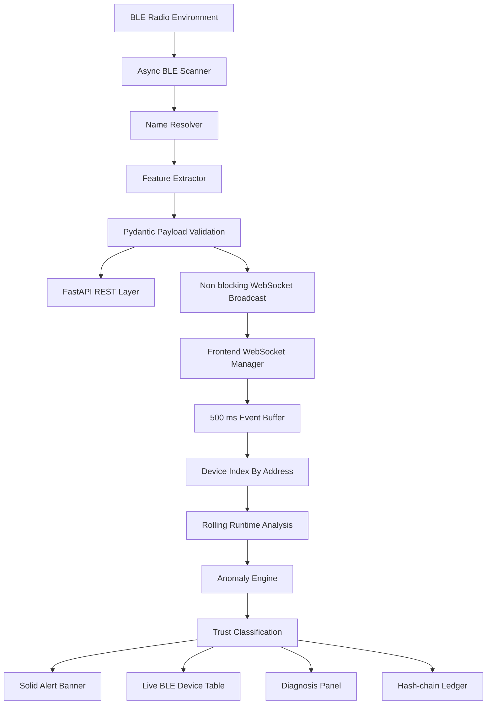
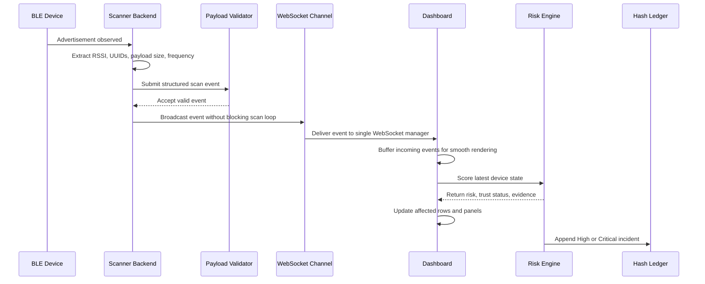
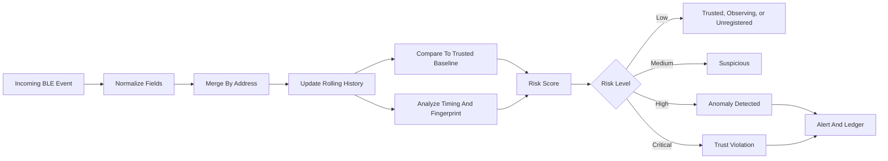

# BLE Trust Registry

BLE Trust Registry is a real-time BLE security dashboard built for one job: watch the local radio environment, recognize trusted devices, expose suspicious behavior quickly, and record serious incidents in a tamper-evident local ledger.

It is not a simulation-first demo. The scanner backend is designed around live BLE advertisements, validated payloads, asynchronous scanning, and a dashboard that stays responsive while events are moving.

## What It Does

- Scans nearby BLE advertisements through a FastAPI scanner backend.
- Resolves usable device names from advertised names, cached names, manufacturer clues, service UUIDs, and address suffixes.
- Streams validated events to the dashboard over a single WebSocket lifecycle.
- Keeps the live device table stable by indexing devices by BLE address.
- Trains trusted baselines from observed live samples.
- Scores risk through rolling behavior, timing, fingerprint, and baseline checks.
- Raises immediate High and Critical trust violation alerts.
- Stores High and Critical incidents in a hash-chain ledger.
- Keeps normal unknown devices low risk until evidence justifies escalation.

## Architecture



## Live Monitoring Workflow



## Trust Decision Pipeline



## Repository Structure

```text
ble-trust-registry/
  README.md
  start-dev.cmd
  start-backend.cmd
  start-frontend.cmd
  frontend/
    app/
      page.tsx
      layout.tsx
      globals.css
    components/
      AlertBanner.tsx
      ui/
    lib/
      anomalyEngine.ts
      behaviorProfile.ts
      fingerprintTracker.ts
      hashChain.ts
      storage.ts
      temporalAnalyzer.ts
      types.ts
      websocket.ts
    package.json
  scanner-backend/
    main.py
    models.py
    name_resolver.py
    scanner.py
    requirements.txt
```

## Installation

Install these first:

- Python 3.11 or newer
- Node.js 20 or newer
- A BLE capable adapter
- Windows PowerShell or another terminal

Backend setup:

```powershell
cd ble-trust-registry\scanner-backend
python -m venv .venv
.\.venv\Scripts\activate
pip install -r requirements.txt
```

Frontend setup:

```powershell
cd ble-trust-registry\frontend
npm.cmd install
```

## Run The Project

From the application root:

```powershell
cd ble-trust-registry
.\start-dev.cmd
```

This starts:

```text
Backend:  http://127.0.0.1:8000
Frontend: http://localhost:3000
```

Open the dashboard:

```text
http://localhost:3000
```

Check backend health:

```text
http://127.0.0.1:8000/status
```

## Manual Run Commands

Backend:

```powershell
cd ble-trust-registry\scanner-backend
python -m uvicorn main:app --host 127.0.0.1 --port 8000
```

Frontend:

```powershell
cd ble-trust-registry\frontend
npm.cmd run dev
```

## Backend API

```text
GET  /status
POST /start-monitoring
POST /stop-monitoring
POST /scan-event
WS   /ws/scan-events
```

Invalid scan payloads are rejected before broadcast. The scanner loop should not be blocked by dashboard delivery or ledger work.

## Dashboard Rules

- The top alert banner is solid for maximum readability.
- The live BLE table is solid and dense, not transparent or blurry.
- Secondary panels can use restrained glassmorphism.
- High and Critical alerts must appear immediately.
- Framer Motion must not delay alert rendering.
- Event history is capped so the dashboard does not grow forever in memory.
- Incoming WebSocket events are batched before state updates.

## Risk Model

The dashboard classifies devices using:

- Registered baseline comparison
- RSSI range and z-score checks
- Advertisement frequency range and rolling behavior
- Payload length deviation
- Service UUID count drift
- Temporal burst detection
- Inter-arrival irregularity
- Fingerprint consistency
- Name and address collision detection

Unknown devices are handled carefully:

```text
Unknown with fewer than 5 observations: Observing, Low
Unknown with normal warmed-up behavior: Unregistered, Low
Known baseline match: Trusted, Low
Known baseline deviation: Suspicious, High, or Critical
```

## Hash-chain Ledger

High and Critical incidents are written to a local hash-chain ledger. Each entry includes incident fields plus the previous hash, then generates the next hash.

```text
timestamp|deviceName|address|riskScore|riskLevel|prediction|trustStatus|reason|previousHash
```

This does not make the browser storage impossible to delete. It makes tampering visible inside the local incident chain.

## Design Direction

The UI should feel like a serious monitoring console: dense, readable, dark, controlled, and operational.

Use restrained glassmorphism only for secondary dashboard panels: subtle transparent dark cards, thin slate borders, low blur, and high text contrast. Do not apply glassmorphism to the live BLE table or alert banner because those require maximum readability. The UI should feel like Elastic SIEM or Grafana with subtle glass panels, not a futuristic neon dashboard.

## Ethical Scope

This project is defensive. It does not include unauthorized BLE exploitation, credential capture, malicious payloads, device compromise, or offensive automation. Test only with devices you own or have permission to monitor.

## More Documentation

```text
docs/architecture.md
docs/workflow.md
docs/installation.md
docs/troubleshooting.md
```
