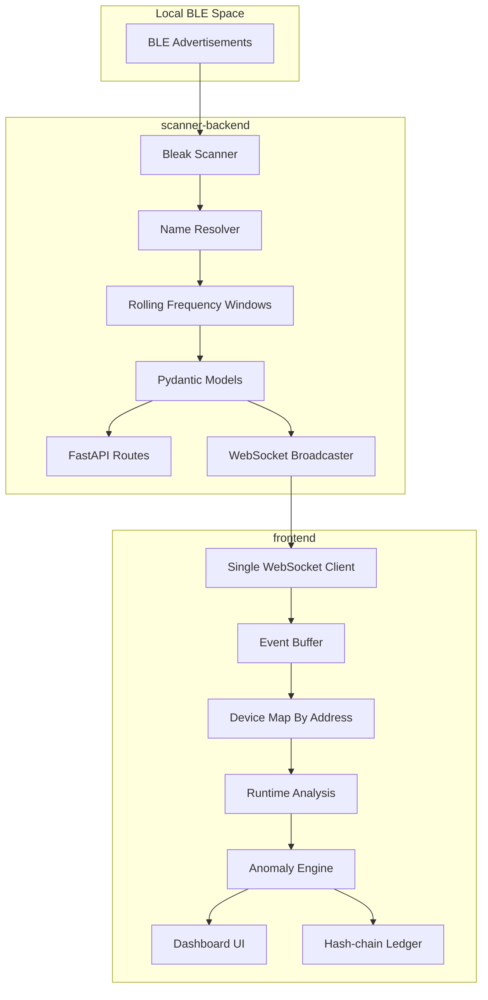
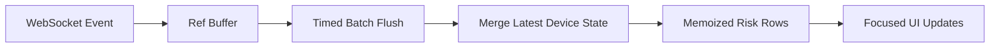

# Architecture

BLE Trust Registry is split into two focused systems: a scanner backend that observes and validates BLE events, and a frontend console that renders the live behavioral trust state without blocking the user interface.

## System Map

## Backend Responsibilities

- Run BLE scanning asynchronously.
- Resolve practical display names for devices.
- Extract RSSI, advertisement frequency, service UUID count, manufacturer data length, and estimated advertisement size.
- Validate scan events before broadcasting.
- Broadcast scan events without blocking the scanner loop.
- Reject malformed controlled anomaly test events with validation errors.

## Frontend Responsibilities

- Own one WebSocket lifecycle manager.
- Avoid duplicate event listeners after reconnect.
- Normalize incoming scan events.
- Batch scan events before React state updates.
- Keep only recent useful event history.
- Merge live devices by BLE address.
- Score devices using baseline and runtime evidence.
- Render High and Critical alerts immediately.
- Append High and Critical events to the hash-chain ledger.

## Performance Shape

The dashboard does not re-render the entire application for each BLE advertisement. Incoming events are pushed into a ref buffer, then flushed to React state on a short interval. This keeps the table stable, the diagnosis panel readable, and the alert banner responsive.

