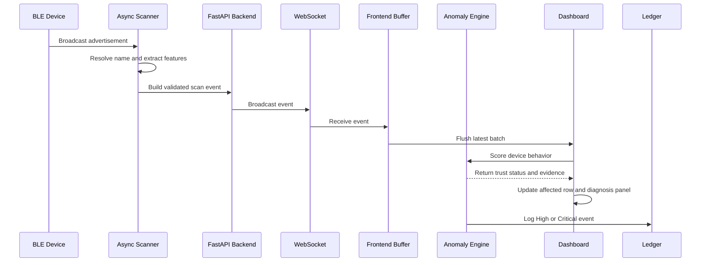
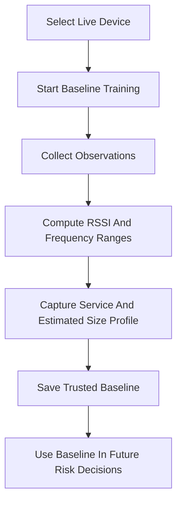
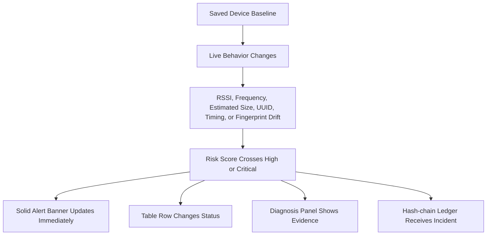

# Workflow

This document explains how a BLE advertisement becomes a trust decision on the dashboard.

## Live Event Flow

## Baseline Training

## Potential Trust Violation Path

## Important Behavior

- Unknown devices do not become suspicious just because they are unknown.
- Trusted devices need a saved baseline.
- High and Critical alerts are not delayed by animation.
- Ledger creation is separate from the scanner loop.
- Device table rows use stable BLE addresses as keys.
- Recent history is capped so long monitoring sessions stay responsive.

